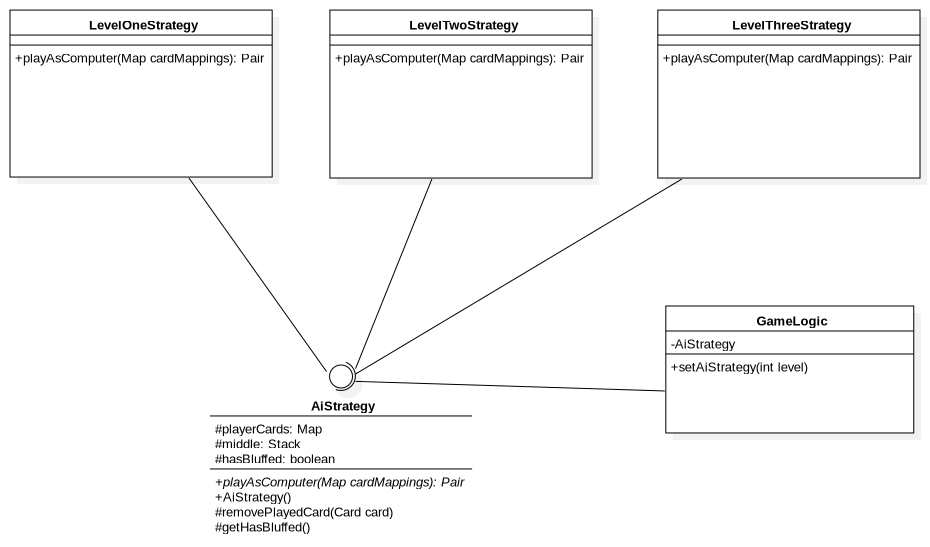

# CENG453 Pişti Game - Frontend Client

This folder contains the frontend client application for the CENG453 Project, Pişti. It was developed using Spring Boot and JavaFX. 

# Getting Started

## Requirements

* JDK 16
* Maven

## Build and Run

1. Use `mvn package` to package the project into a jar file. 
2. Run the created jar file in the target folder as follows: `java -jar client-0.0.1-SNAPSHOT.jar`
3. Run the backend server according to the instructions in the server folder.
4. The application should be up and running.

# How to Play

1. Sign up (if you do not have an account)
2. Sign in using your account
3. Click New Game
4. For the first two levels, you will be playing Regular Pişti with the AI, with incremental difficulty level. The game will re-deal cards until one of the players reach a minimum of 151 points. When a player reaches 151 or more points, the level will be concluded when there are no more cards to be dealt.
5. To place a card to the middle stack, simply click on the card that you want to drop.
6. Starting from the third level, you will be able to play Bluffing Pişti. In this version, the AI and you can bluff, if there is only one card placed on the middle stack. If the AI bluffs, you will see a Challenge button, and clicking that button means that you think the AI is bluffing, and you want to see the card. If you think the AI is not bluffing, you can simply throw a card to continue with the game.
7. To bluff, you need to click a card using the right click of the mouse. Left click throws the card regularly, and right click means you're bluffing. 
8. If you want to exit the game, you can always use the Leave button.
9. Enjoy!

For a detailed explanation of the rules, you may refer to [http://catsatcards.com/Games/Pisti.html](http://catsatcards.com/Games/Pisti.html).

## Level 1 Play Screen

## Level 3 AI Bluff Screen 

When received a bluff, you can either challenge it or accept it. 

# AI Strategies by Level

## Level One

The first level has a very simple AI mechanism. In this level, the AI simply throws the cards starting from the leftmost one to the rightmost one. It does not care about having matching cards.

## Level Two

The second level has an improved AI mechanism. In this level, the AI checks the middle stack. 
* If the middle stack is empty, it plays a random card. 
* If there is a card in the stack, it tries to play a matching card. 
* If it cannot find a matching card, it plays a random card.

## Level Three

Since the third level has bluffing, the AI in this level is fairly improved. 
* If there is only one card in the middle stack, with a probability of 33%, the AI will bluff. 
* If the AI decided to bluff, with 50% chance, it tries to make this a real bluff. If a real bluff is not possible, it selects a random card.
* If the AI decided not to bluff, it tries all the cards at its hand to calculate their scores, and selects the best card.
* If all cards perform 0 on the tests, it selects a random card.

# Design Patterns

During the development of the project, we have applied several design patterns to improve our project. You may find detailed explanation about them below.

## Strategy Pattern

Strategy Pattern was used while implementing the AI Strategies. Since each level has a different difficulty, creating a common interface for the AI and then implementing different strategies seemed the most suitable one for our project. A UML diagram of the mentioned structure can be seen below:

## Singleton Pattern

We made use of the Singleton Pattern in our project on several occasions.
* Keeping state: Using singleton pattern allowed us to keep state between different user interfaces without reloading / fetching the data from the server.
* Keeping only one instance: Singleton pattern allowed us to keep some entities with only one instance, which was useful for some service classes (such as HTTPService)
* Minimizing overhead: Keeping only one copy of a class helped us with not having excess overhead due to creating and destroying the same objects over again and again.

# Password Encryption and Security

To ensure maximum security, we have used different encryption and hash technologies to store and transfer passwords of the users. We never transfer or store plaintext passwords within our system.

## Frontend Client

When a user tries to register or login using the frontend client, the password gets hashed through SHA-256 and then sent to the backend.

## Backend Client

When the backend receives a request with a hashed password, it encodes the hashed password with BCrypt and then stores it.

# Documentation

The JavaDoc files are available under the [docs/javadocs](docs/javadocs) folder.

 
# Tests

For the testing of the project, we have developed unit and GUI tests. Further details about them can be found below.

## Unit and GUI Tests

The unit and GUI tests for the project are available under the `test` folder. The tests can be run through either an IDE, or during `mvn package`. 

* **GameLogicTests**: Tests of the Game Logic.
* **LevelOneStrategyTests**: Tests of the Level One Strategy.
* **LevelTwoStrategyTests**: Tests of the Level Two Strategy.
* **LevelThreeStrategyTests**: Tests of the Level Three Strategy.
* **GameControllerTests**: Tests of the Game Screen GUI.
* **ForgotControllerTests**: Tests of the Reset Password Screen GUI.
* **HomeControllerTests**: Tests of the Home Screen GUI.
* **LoginControllerTests**: Tests of the Login Screen GUI.
* **RegisterControllerTests**: Tests of the Register Screen GUI.

