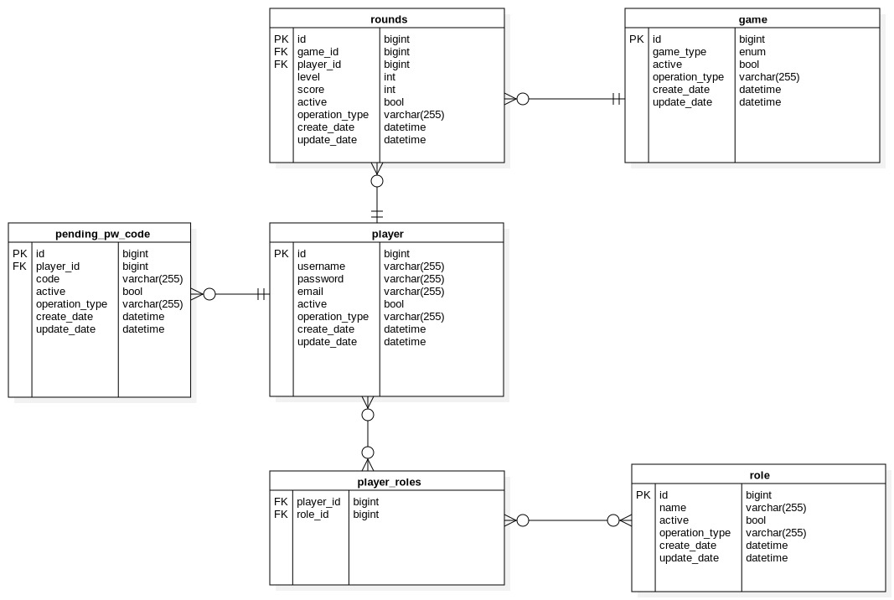

# CENG453 Pişti Game - Backend Server 

This folder contains the backend server application for the CENG453 Project, Pişti. It was developed using Spring Boot, MariaDB and Apache Tomcat. 

# Getting Started

## Requirements

* JDK 16
* Maven

## Build and Run

1. Use `mvn package` to package the project into a jar file. 
2. Run the created jar file in the target folder as follows: `java -jar server-0.0.1-SNAPSHOT.jar`
3. The server should be up and running at `http://localhost:8080/`.

# Database Design 

-- TODO 

# API Documentation

-- TODO 

 `http://localhost:8080/swagger-ui.html`

 
 # Tests

 -- TODO 

